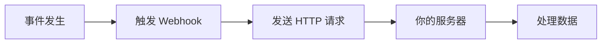

在现代 Web 开发中，Webhook 已经成为不可或缺的技术之一。无论是 GitHub 的自动部署、支付平台的交易通知，还是聊天机器人的消息推送，Webhook 无处不在。今天，让我们深入了解这个强大的事件驱动机制。

## 什么是 Webhook？

Webhook 是一种**反向 API**机制，允许一个应用在特定事件发生时主动向另一个应用发送实时数据。简单来说，它是一种"**别找我，我会找你**"的通信方式。

### 核心概念



**传统 API vs Webhook：**

| 特性 | 传统 API (轮询) | Webhook |
|------|----------------|---------|
| 通信方式 | 客户端主动请求 | 服务端主动推送 |
| 实时性 | 需要频繁轮询 | 事件发生立即通知 |
| 资源消耗 | 高（大量无效请求） | 低（仅在需要时通信） |
| 复杂度 | 简单 | 需要公网地址和错误处理 |

## Webhook 的工作原理

### 1. 基本流程

```javascript
// Webhook 的生命周期
1. 注册 Webhook URL
   ↓
2. 事件发生
   ↓
3. 构造 Payload
   ↓
4. 发送 HTTP POST 请求
   ↓
5. 接收方处理
   ↓
6. 返回响应状态
```

### 2. 典型的 Webhook 请求

```http
POST /webhooks/github HTTP/1.1
Host: your-server.com
Content-Type: application/json
X-GitHub-Event: push
X-GitHub-Delivery: 12345-67890
X-Hub-Signature-256: sha256=abcdef123456...

{
  "ref": "refs/heads/main",
  "repository": {
    "name": "your-repo",
    "full_name": "username/your-repo"
  },
  "pusher": {
    "name": "username",
    "email": "user@example.com"
  },
  "commits": [
    {
      "id": "abc123",
      "message": "Update README.md",
      "timestamp": "2025-01-15T10:00:00Z"
    }
  ]
}
```

## 实际应用场景

### 1. 🚀 CI/CD 自动部署

GitHub/GitLab 推送代码后自动触发构建和部署：

```javascript
// Node.js Express 示例
app.post('/webhook/github', (req, res) => {
  const { ref, repository } = req.body;
  
  if (ref === 'refs/heads/main') {
    // 触发部署流程
    deployApplication(repository.name);
    res.status(200).send('Deployment started');
  } else {
    res.status(200).send('Ignored non-main branch');
  }
});
```

### 2. 💳 支付通知

处理 Stripe 支付成功事件：

```javascript
// Stripe Webhook 处理
app.post('/webhook/stripe', express.raw({type: 'application/json'}), (req, res) => {
  const sig = req.headers['stripe-signature'];
  let event;
  
  try {
    event = stripe.webhooks.constructEvent(req.body, sig, endpointSecret);
  } catch (err) {
    return res.status(400).send(`Webhook Error: ${err.message}`);
  }
  
  // 处理不同类型的事件
  switch (event.type) {
    case 'payment_intent.succeeded':
      const paymentIntent = event.data.object;
      handleSuccessfulPayment(paymentIntent);
      break;
    case 'customer.subscription.created':
      const subscription = event.data.object;
      activateSubscription(subscription);
      break;
    default:
      console.log(`Unhandled event type ${event.type}`);
  }
  
  res.status(200).json({received: true});
});
```

### 3. 🤖 聊天机器人

Slack/Discord 机器人响应消息：

```python
# Python Flask 示例
@app.route('/webhook/slack', methods=['POST'])
def slack_webhook():
    data = request.json
    
    if data['type'] == 'url_verification':
        # Slack 验证请求
        return jsonify({'challenge': data['challenge']})
    
    elif data['type'] == 'event_callback':
        event = data['event']
        
        if event['type'] == 'message' and 'bot_id' not in event:
            # 响应用户消息
            if '帮助' in event['text']:
                send_help_message(event['channel'])
            
    return '', 200
```

### 4. 📊 数据同步

实时同步不同系统之间的数据：

```javascript
// 电商订单同步到 CRM
app.post('/webhook/shopify/orders', async (req, res) => {
  const order = req.body;
  
  try {
    // 验证 webhook 签名
    if (!verifyShopifyWebhook(req)) {
      return res.status(401).send('Unauthorized');
    }
    
    // 同步到 CRM 系统
    await crmAPI.createCustomer({
      email: order.email,
      name: order.customer.name,
      totalSpent: order.total_price
    });
    
    // 发送欢迎邮件
    await emailService.sendWelcome(order.email);
    
    res.status(200).send('Order processed');
  } catch (error) {
    console.error('Webhook processing failed:', error);
    res.status(500).send('Internal error');
  }
});
```

## 实现 Webhook 接收端

### 1. 基础实现

```javascript
const express = require('express');
const crypto = require('crypto');
const app = express();

// 解析 JSON 请求体
app.use(express.json());

// Webhook 端点
app.post('/webhook', (req, res) => {
  // 1. 验证请求来源
  const signature = req.headers['x-signature'];
  const expectedSignature = crypto
    .createHmac('sha256', process.env.WEBHOOK_SECRET)
    .update(JSON.stringify(req.body))
    .digest('hex');
    
  if (signature !== expectedSignature) {
    return res.status(401).send('Invalid signature');
  }
  
  // 2. 处理事件
  const { event, data } = req.body;
  
  // 3. 异步处理避免超时
  setImmediate(() => {
    processWebhookEvent(event, data);
  });
  
  // 4. 立即返回响应
  res.status(200).send('OK');
});

// 事件处理函数
async function processWebhookEvent(event, data) {
  try {
    switch (event) {
      case 'user.created':
        await handleUserCreated(data);
        break;
      case 'order.completed':
        await handleOrderCompleted(data);
        break;
      default:
        console.log(`Unknown event: ${event}`);
    }
  } catch (error) {
    console.error(`Error processing ${event}:`, error);
    // 可能需要重试逻辑
  }
}
```

### 2. 生产环境最佳实践

```javascript
class WebhookHandler {
  constructor(options = {}) {
    this.secret = options.secret;
    this.timeout = options.timeout || 30000;
    this.retryAttempts = options.retryAttempts || 3;
    this.queue = []; // 简单队列实现
  }
  
  // 验证签名
  verifySignature(payload, signature) {
    const algorithms = ['sha256', 'sha1']; // 支持多种算法
    
    for (const algo of algorithms) {
      const expected = crypto
        .createHmac(algo, this.secret)
        .update(payload)
        .digest('hex');
        
      if (signature === `${algo}=${expected}`) {
        return true;
      }
    }
    
    return false;
  }
  
  // 处理 Webhook 请求
  async handle(req, res) {
    const rawBody = req.body;
    const signature = req.headers['x-webhook-signature'];
    
    // 1. 验证签名
    if (!this.verifySignature(rawBody, signature)) {
      return res.status(401).json({ error: 'Invalid signature' });
    }
    
    // 2. 解析请求体
    let payload;
    try {
      payload = JSON.parse(rawBody);
    } catch (error) {
      return res.status(400).json({ error: 'Invalid JSON' });
    }
    
    // 3. 幂等性检查
    const eventId = req.headers['x-webhook-id'];
    if (await this.isDuplicate(eventId)) {
      return res.status(200).json({ status: 'Already processed' });
    }
    
    // 4. 加入处理队列
    this.queue.push({
      id: eventId,
      payload: payload,
      attempts: 0
    });
    
    // 5. 立即响应
    res.status(200).json({ status: 'Accepted' });
    
    // 6. 异步处理
    this.processQueue();
  }
  
  // 处理队列中的事件
  async processQueue() {
    while (this.queue.length > 0) {
      const event = this.queue.shift();
      
      try {
        await this.processEvent(event.payload);
        await this.markAsProcessed(event.id);
      } catch (error) {
        event.attempts++;
        
        if (event.attempts < this.retryAttempts) {
          // 延迟重试
          setTimeout(() => {
            this.queue.push(event);
            this.processQueue();
          }, Math.pow(2, event.attempts) * 1000);
        } else {
          // 记录失败事件
          await this.logFailedEvent(event, error);
        }
      }
    }
  }
}
```

## 安全性考虑

### 1. 🔐 签名验证

始终验证 Webhook 请求的真实性：

```javascript
// HMAC 签名验证示例
function verifyWebhookSignature(payload, signature, secret) {
  const hmac = crypto.createHmac('sha256', secret);
  const digest = Buffer.from('sha256=' + hmac.update(payload).digest('hex'), 'utf8');
  const checksum = Buffer.from(signature, 'utf8');
  
  // 使用时间恒定的比较避免时序攻击
  if (checksum.length !== digest.length) {
    return false;
  }
  
  return crypto.timingSafeEqual(digest, checksum);
}
```

### 2. 🛡️ 安全清单

- ✅ **HTTPS Only**: 始终使用 HTTPS 端点
- ✅ **验证签名**: 验证每个请求的签名
- ✅ **IP 白名单**: 如果可能，限制请求来源 IP
- ✅ **超时处理**: 快速响应，避免超时
- ✅ **幂等性**: 处理重复请求
- ✅ **速率限制**: 防止 DoS 攻击
- ✅ **错误处理**: 优雅处理异常情况

### 3. 🔄 幂等性处理

```javascript
// 使用 Redis 实现幂等性
async function handleWebhookIdempotently(eventId, handler) {
  const key = `webhook:${eventId}`;
  const exists = await redis.exists(key);
  
  if (exists) {
    console.log(`Event ${eventId} already processed`);
    return { status: 'duplicate' };
  }
  
  try {
    const result = await handler();
    
    // 标记为已处理，设置过期时间
    await redis.setex(key, 86400, 'processed'); // 24小时过期
    
    return result;
  } catch (error) {
    // 失败不标记，允许重试
    throw error;
  }
}
```

## 开发和测试工具

### 1. 🧪 本地测试

使用 ngrok 暴露本地服务：

```bash
# 安装 ngrok
npm install -g ngrok

# 暴露本地 3000 端口
ngrok http 3000

# 获得公网 URL
# https://abc123.ngrok.io -> http://localhost:3000
```

### 2. 🔧 测试工具推荐

- **[Webhook.site](https://webhook.site)**: 在线 Webhook 测试工具
- **[RequestBin](https://requestbin.com)**: 检查 HTTP 请求内容
- **[Postman](https://www.postman.com)**: API 测试和模拟
- **[localtunnel](https://localtunnel.github.io)**: ngrok 的替代品

### 3. 📝 日志和监控

```javascript
// 结构化日志记录
const winston = require('winston');

const logger = winston.createLogger({
  format: winston.format.json(),
  transports: [
    new winston.transports.File({ filename: 'webhooks.log' })
  ]
});

function logWebhook(req, res, processingTime) {
  logger.info({
    type: 'webhook_received',
    endpoint: req.path,
    method: req.method,
    headers: req.headers,
    event: req.body.event,
    status: res.statusCode,
    processingTime: processingTime,
    timestamp: new Date().toISOString()
  });
}
```

## 常见问题和解决方案

### Q1: Webhook 请求超时怎么办？

**解决方案**: 立即返回 200 状态码，使用队列异步处理：

```javascript
app.post('/webhook', (req, res) => {
  // 立即响应
  res.status(200).send();
  
  // 异步处理
  jobQueue.add('processWebhook', req.body);
});
```

### Q2: 如何处理 Webhook 重试？

**解决方案**: 实现指数退避重试机制：

```javascript
async function retryWebhook(url, payload, attempt = 1) {
  const maxAttempts = 5;
  
  try {
    await axios.post(url, payload, { timeout: 5000 });
  } catch (error) {
    if (attempt < maxAttempts) {
      const delay = Math.pow(2, attempt) * 1000; // 指数退避
      await sleep(delay);
      return retryWebhook(url, payload, attempt + 1);
    }
    throw error;
  }
}
```

### Q3: 如何调试生产环境的 Webhook？

**解决方案**: 实现 Webhook 转发和重放功能：

```javascript
// 保存所有 webhook 请求
async function saveWebhookRequest(req) {
  await db.webhookLogs.create({
    headers: req.headers,
    body: req.body,
    timestamp: new Date(),
    processed: false
  });
}

// 重放 webhook
async function replayWebhook(webhookId) {
  const webhook = await db.webhookLogs.findById(webhookId);
  return processWebhookEvent(webhook.body);
}
```

## 最佳实践总结

### ✅ DO's

1. **快速响应**: 3秒内返回 2xx 状态码
2. **异步处理**: 使用队列处理耗时操作
3. **幂等设计**: 支持安全的重试
4. **完整日志**: 记录所有请求和响应
5. **优雅降级**: 处理服务不可用情况
6. **版本控制**: 支持多版本 Webhook API

### ❌ DON'Ts

1. **不要信任输入**: 始终验证和清理数据
2. **不要阻塞响应**: 避免同步执行长时间操作
3. **不要忽略错误**: 正确处理和记录所有异常
4. **不要硬编码密钥**: 使用环境变量管理敏感信息
5. **不要忽视监控**: 实时监控 Webhook 健康状态

## 实战项目：构建 Webhook 管理系统

```javascript
// 简单的 Webhook 管理系统
class WebhookManager {
  constructor() {
    this.endpoints = new Map();
    this.middleware = [];
  }
  
  // 注册 webhook 端点
  register(event, handler) {
    if (!this.endpoints.has(event)) {
      this.endpoints.set(event, []);
    }
    this.endpoints.get(event).push(handler);
  }
  
  // 添加中间件
  use(middleware) {
    this.middleware.push(middleware);
  }
  
  // 触发 webhook
  async trigger(event, data) {
    const handlers = this.endpoints.get(event) || [];
    
    // 执行中间件
    for (const mw of this.middleware) {
      data = await mw(event, data);
    }
    
    // 并行执行所有处理器
    const results = await Promise.allSettled(
      handlers.map(handler => handler(data))
    );
    
    // 记录失败的处理器
    results.forEach((result, index) => {
      if (result.status === 'rejected') {
        console.error(`Handler ${index} failed:`, result.reason);
      }
    });
    
    return results;
  }
}

// 使用示例
const webhooks = new WebhookManager();

// 注册处理器
webhooks.register('user.created', async (user) => {
  await sendWelcomeEmail(user.email);
});

webhooks.register('user.created', async (user) => {
  await addToMailingList(user.email);
});

// 添加日志中间件
webhooks.use(async (event, data) => {
  console.log(`Webhook triggered: ${event}`, data);
  return data;
});

// 触发事件
await webhooks.trigger('user.created', {
  id: 123,
  email: 'user@example.com',
  name: 'John Doe'
});
```

## 总结

Webhook 作为现代 Web 开发中的重要技术，提供了高效、实时的事件驱动通信方式。掌握 Webhook 的原理和最佳实践，能够帮助我们构建更加响应式和解耦的系统架构。

记住以下关键点：
- 🚀 **实时性**: Webhook 提供近乎实时的事件通知
- 🔒 **安全性**: 始终验证请求来源和数据完整性
- ⚡ **性能**: 快速响应，异步处理
- 🔄 **可靠性**: 实现重试和幂等性机制

无论是集成第三方服务，还是构建微服务架构，Webhook 都是值得掌握的核心技术。希望这篇文章能帮助你更好地理解和应用 Webhook！

## 参考资源

- [Webhook.org](https://www.webhook.org/) - Webhook 标准和最佳实践
- [GitHub Webhooks 文档](https://docs.github.com/en/developers/webhooks-and-events/webhooks)
- [Stripe Webhooks 指南](https://stripe.com/docs/webhooks)
- [Google Cloud Pub/Sub](https://cloud.google.com/pubsub) - 企业级事件驱动架构